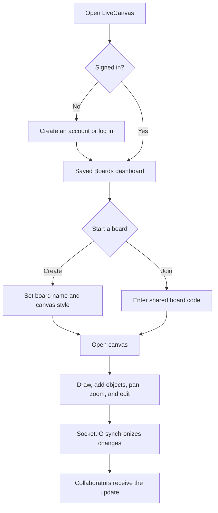
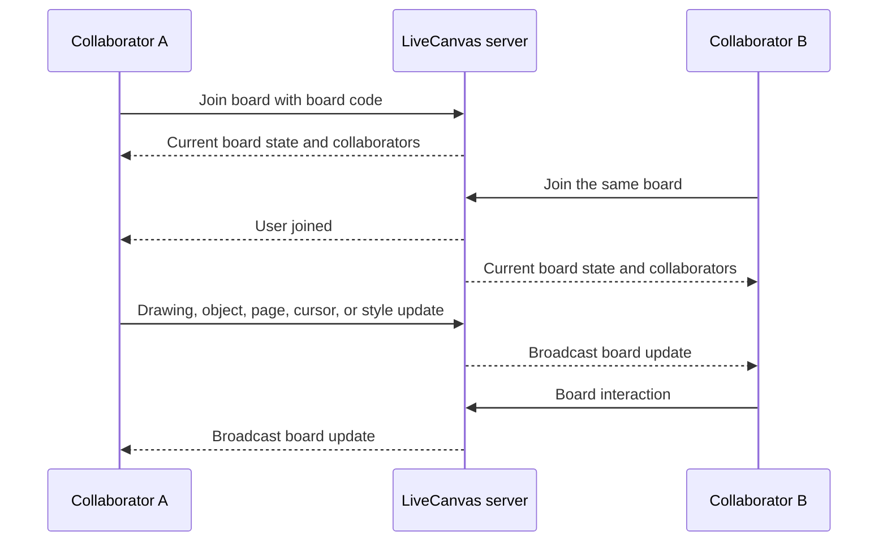
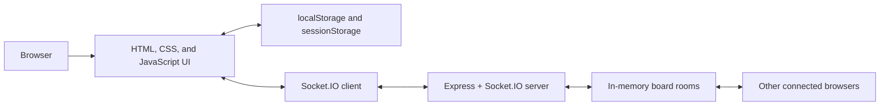

# LiveCanvas

LiveCanvas is a real-time collaborative whiteboard for turning ideas into shared visual work. It combines a friendly project dashboard with a multi-user canvas where collaborators can draw, add objects, move around the board, and see one another’s cursors as they work.

The application is deliberately lightweight: the user interface is built with plain HTML, CSS, and JavaScript, while an Express and Socket.IO server provides live board synchronization. No build step or framework tooling is required to run it locally.

## Highlights

- Create a named board and select a blank, grid, dotted, or lined canvas.
- Join an existing board with its shareable board code.
- Draw with pen, highlighter, and eraser tools, with selectable colours and stroke widths.
- Add and edit text, sticky notes, shapes, images, and table-style objects.
- Select, drag, update, and delete objects on the canvas.
- Pan and zoom the workspace, extend pages, and use undo/redo controls.
- See connected collaborators, their assigned avatars, and their live cursor positions.
- Search and sort locally saved boards by recency, name, or age.
- Store local account and board metadata in browser storage, with a server-side in-memory board state for live sessions.

## User journey



## Collaboration flow



## Pages

| Page | Purpose | Main capabilities |
| --- | --- | --- |
| `home.html` | Landing page | Introduces LiveCanvas, explains the product, and directs a visitor to authentication or their saved boards. |
| `signup.html` | Registration | Validates a name, email, and password; stores the local account; starts a browser session. |
| `login.html` | Authentication | Verifies locally stored credentials and takes the user to the Saved Boards dashboard. |
| `saved.html` | Project dashboard | Creates or joins boards, selects canvas styles, searches boards, sorts projects, and manages the local account menu. |
| `room.html` | Room entry | Creates a shareable room link or joins a room by code after authentication. |
| `index.html` | Collaborative canvas | Provides drawing tools, object editing, board sharing, collaborators, live cursors, navigation, zoom, and synchronization. |

## Canvas capabilities

### Drawing and editing

- **Pen, highlighter, and eraser:** choose a tool, select a colour, and adjust the stroke width.
- **Objects:** create text, sticky notes, shapes, images, and table-style content; then select, move, update, or delete them.
- **History:** undo and redo supported canvas actions.
- **Navigation:** pan the canvas and use the zoom controls to focus on the relevant part of a board.
- **Canvas styles:** use blank, grid, dotted, or lined backgrounds to match the task.
- **Pages:** board state includes pages and page resizing/extension so a board can grow with the work.

### Live collaboration

- A board code identifies the shared board session.
- The server tracks board title, canvas style, zoom level, current page, drawings, and objects in memory.
- Socket.IO broadcasts drawing, object, page, document-state, canvas-style, cursor, and collaborator updates to other users in the same board.
- Collaborators receive a deterministic cursor colour and an avatar assignment for easier visual identification.

## Architecture



### Frontend

- Plain HTML pages define the landing, authentication, dashboard, room, and canvas experiences.
- `style.css` and `auth.css` provide the shared canvas and authentication styling.
- `script.js` owns canvas tools, object state, local caching, board controls, and Socket.IO client events.
- `cursor.js` renders the custom local pointer and collaborator cursor presentation.

### Backend

- `backend/server.js` serves the static frontend and exposes the Socket.IO server.
- Board sessions live in an in-memory `Map`, keyed by board code.
- `GET /health` reports server status, the number of active board sessions, and the current server time.

## Data and persistence

| Data | Where it lives | Notes |
| --- | --- | --- |
| Accounts and active local user | `localStorage` | Used by the browser-only authentication flow. |
| Saved board metadata | `localStorage` | Includes board IDs, names, style choices, dates, and card colours. |
| Current board selection | `sessionStorage` | Keeps the current board context while navigating within a browser session. |
| Active collaborative board state | Server memory | Shared while the Node.js server is running; resets when the server restarts. |

> **Development note:** authentication is browser-local and intended for this project’s local/demo workflow. It is not a production authentication system.

## Project structure

```text
Live-Canvas/
├── assets/                 # Logos, illustrations, profile images, and stickers
├── backend/
│   ├── package.json         # Backend dependencies and start command
│   └── server.js            # Express + Socket.IO collaboration server
├── auth.css                 # Shared login and sign-up styles
├── cursor.js                # Custom cursor behavior
├── home.html                # Landing page
├── index.html               # Collaborative whiteboard
├── login.html               # Login page and client logic
├── login.js
├── room.html                # Create/join room page
├── room.js
├── saved.html               # Saved-boards dashboard
├── script.js                # Whiteboard behavior and real-time client logic
├── signup.html              # Registration page
├── signup.js
└── style.css                # Shared whiteboard and room styles
```

## Screenshots

Add screenshots in `docs/images/` using the filenames below. Once the files are added, replace each placeholder with a standard Markdown image link if desired.

### Home page

> Add `docs/images/home.png` here — landing page, feature sections, and call to action.

### Login page

> Add `docs/images/login.png` here — sign-in form and illustration.

### Sign-up page

> Add `docs/images/signup.png` here — registration form and illustration.

### Saved Boards dashboard

> Add `docs/images/saved-boards.png` here — project cards, search, sort, and create/join modal.

### Room page

> Add `docs/images/rooms.png` here — room creation, board code, and join controls.

### Collaborative canvas

> Add `docs/images/canvas.png` here — tools, collaborators, objects, and board navigation.

## Requirements

- [Node.js](https://nodejs.org/) 18 or later
- npm (installed with Node.js)
- A modern browser with JavaScript enabled

## Run locally

1. Clone or download this repository, then open a terminal in the project root.
2. Install the backend dependencies:

   ```bash
   cd backend
   npm install
   ```

3. Start LiveCanvas:

   ```bash
   npm start
   ```

4. Open [http://localhost:3000](http://localhost:3000) in your browser.
5. Create an account, open a board from **Saved Boards**, and share the board code with another browser session to try real-time collaboration.

### Useful local URLs

| URL | Description |
| --- | --- |
| `http://localhost:3000/` | Landing page |
| `http://localhost:3000/health` | JSON health/status response |
| `http://localhost:3000/login.html` | Login page |
| `http://localhost:3000/signup.html` | Registration page |
| `http://localhost:3000/saved.html` | Saved Boards dashboard |

## Development notes

- The server runs on port `3000` by default.
- The server serves the frontend directly, so a separate frontend development server is not required.
- Restarting the Node.js server clears its active in-memory boards. Browser-local saved boards and accounts remain in that browser unless local storage is cleared.
- For a clean local demo, clear the site’s local storage in your browser’s developer tools and restart the server.

## License

This project is licensed under the MIT License.
