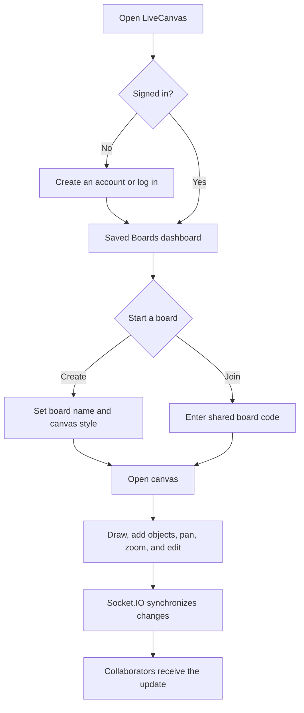
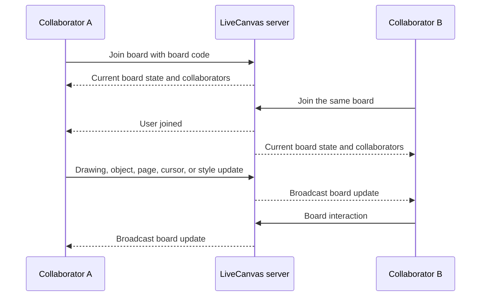
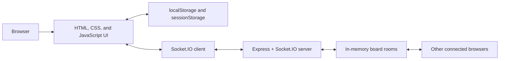

# LiveCanvas

LiveCanvas is a real-time collaborative whiteboard for turning ideas into shared visual work. It combines a friendly project dashboard with a multi-user canvas where collaborators can draw, add objects, move around the board, and see one another’s cursors as they work.

The application is deliberately lightweight: the user interface is built with plain HTML, CSS, and JavaScript, while an Express and Socket.IO server provides live board synchronization. No build step or framework tooling is required to run it locally.

## Highlights

- Create a named board and select a blank, grid, dotted, or lined canvas.
- Join an existing board with its shareable board code.
- Draw with pen, highlighter, and eraser tools, with selectable colours and stroke widths.
- Add and edit text, sticky notes, shapes, images, and table-style objects.
- Select, drag, update, and delete objects on the canvas.
- Pan and zoom the workspace, extend pages, and use undo/redo controls.
- See connected collaborators, their assigned avatars, and their live cursor positions.
- Search and sort locally saved boards by recency, name, or age.
- Store local account and board metadata in browser storage, with a server-side in-memory board state for live sessions.

## User journey



## Collaboration flow



## Pages

| Page | Purpose | Main capabilities |
| --- | --- | --- |
| `home.html` | Landing page | Introduces LiveCanvas, explains the product, and directs a visitor to authentication or their saved boards. |
| `signup.html` | Registration | Validates a name, email, and password; stores the local account; starts a browser session. |
| `login.html` | Authentication | Verifies locally stored credentials and takes the user to the Saved Boards dashboard. |
| `saved.html` | Project dashboard | Creates or joins boards, selects canvas styles, searches boards, sorts projects, and manages the local account menu. |
| `room.html` | Room entry | Creates a shareable room link or joins a room by code after authentication. |
| `index.html` | Collaborative canvas | Provides drawing tools, object editing, board sharing, collaborators, live cursors, navigation, zoom, and synchronization. |

## Canvas capabilities

### Drawing and editing

- **Pen, highlighter, and eraser:** choose a tool, select a colour, and adjust the stroke width.
- **Objects:** create text, sticky notes, shapes, images, and table-style content; then select, move, update, or delete them.
- **History:** undo and redo supported canvas actions.
- **Navigation:** pan the canvas and use the zoom controls to focus on the relevant part of a board.
- **Canvas styles:** use blank, grid, dotted, or lined backgrounds to match the task.
- **Pages:** board state includes pages and page resizing/extension so a board can grow with the work.

### Live collaboration

- A board code identifies the shared board session.
- The server tracks board title, canvas style, current page, drawings, and objects in memory. Zoom is a local viewer preference.
- Socket.IO broadcasts drawing, object, page, document-state, canvas-style, cursor, and collaborator updates to other users in the same board.
- Collaborators receive a deterministic cursor colour and an avatar assignment for easier visual identification.

## Architecture



### Frontend

- Plain HTML pages define the landing, authentication, dashboard, room, and canvas experiences.
- `style.css` and `auth.css` provide the shared canvas and authentication styling.
- `script.js` owns canvas tools, object state, local caching, board controls, and Socket.IO client events.
- `cursor.js` renders the custom local pointer and collaborator cursor presentation.

### Backend

- `backend/server.js` serves the static frontend and exposes the Socket.IO server.
- Board sessions live in an in-memory `Map`, keyed by board code.
- `GET /health` reports server status, the number of active board sessions, and the current server time.

## Backend implementation reference

### HTTP server and runtime

The backend is a Node.js application using Express and Socket.IO.

- Express serves the project root as static files and sends `home.html` for `GET /`.
- `express.json({ limit: "10mb" })` is enabled for JSON request bodies.
- Socket.IO uses the same HTTP server as Express and accepts `GET` and `POST` origins through its current permissive CORS configuration (`origin: "*"`).
- `GET /health` returns `{ status, service, boards, time }`, which is useful for checking that the process is alive.
- The default port is `3000`.

### In-memory board model

The server holds active boards in a `Map` named `boards`. Each board is keyed by its board code and includes:

```text
boardId, title, canvasStyle, currentPage, pages, updatedAt
```

Each page contains its own `id`, `height`, optional `canvasData`, `drawings`, and `objects`. This design isolates collaborative state by board code while keeping every active board available to connected Socket.IO clients.

Because this is memory-only storage, board state is **not durable**. Restarting the Node.js server clears all server-side boards and their active collaboration state.

### Socket.IO rooms and synchronization

When a browser emits `join-room`, the server validates its board code and display name, creates the board if necessary, and joins the socket to a Socket.IO room named after that board code. The joining client receives the current board state and collaborator list; other members receive a user-joined update.

The server maintains and broadcasts collaboration events for:

- drawing segments and canvas styles;
- document and full-board state updates;
- object creation, updates, and deletion;
- page changes, additions, and resizing;
- canvas clearing;
- cursor movement and cursor departure;
- user join, leave, and profile updates.

Events are broadcast to the other sockets in the same board room, keeping separate board codes isolated from one another.

### Validation and sanitization

The server does not blindly store all incoming socket data. It currently performs the following checks before accepting board updates:

- Board IDs must be non-empty strings of at most 100 characters.
- Usernames are trimmed, required, and truncated to 100 characters.
- Canvas styles are limited to `blank`, `grid`, `dots`, and `lines`.
- Drawing coordinates must be finite numbers; tools are limited to pen, eraser, highlighter, and light pen; line width is clamped from 1 to 100.
- Zoom is clamped from 50% to 200%.
- Page height is clamped from 300 to 100,000 pixels.
- Page arrays, drawing operations, and object positions are sanitized before full board state is stored.
- Cursor coordinates must be finite numbers before they are relayed.

These checks improve resilience against malformed collaboration payloads. They are not a replacement for authorization or a production security model.

## Data and persistence

### Browser local storage

`localStorage` persists for the current browser profile until the user clears site data. LiveCanvas uses it for local/demo persistence:

| Key | Value stored | Purpose |
| --- | --- | --- |
| `users` | Array of local user records | Stores registration name, email, and password hash. |
| `loggedInUser` | `{ name, email }` | Indicates the current locally signed-in user. |
| `savedBoards` | Array of board metadata | Stores board IDs, names, style choices, dates, update times, and dashboard colour indexes. |
| `userProfilePicIdx` | Profile-image number | Keeps a consistent generated profile image for the user. |
| `liveCanvasDocument_<boardId>` | Cached document object | Saves pages, drawings, objects, the local zoom preference, title, canvas style, current page, and save time for a board. |

The document cache is a browser-side fallback and convenience layer. It is separate from the server’s live in-memory board state.

### Session retention

`sessionStorage` is scoped to the current browser tab/session and normally clears when that session ends. The app uses it for navigation context rather than long-term data:

| Key | Purpose |
| --- | --- |
| `currentBoardId` | Identifies the board the user most recently opened. |
| `currentBoardName` | Preserves the current board title while moving between pages. |
| `currentCanvasStyle` | Carries the selected canvas style into the board flow. |
| `roomId` | Keeps the current room context for room-based entry. |

This is session retention, not a server-issued session token. No cookie session, JWT, or server-side user session store is currently implemented.

### Password handling

Passwords are **hashed, not encrypted**. Encryption is reversible with a key; hashing is a one-way transformation used for password comparison.

1. On sign-up, the browser trims the password and uses the Web Crypto API’s `crypto.subtle.digest("SHA-256", ...)` when it is available.
2. The resulting SHA-256 digest is stored as a hexadecimal string in the `password` field of the relevant `users` record in `localStorage`.
3. On login, the browser hashes the entered password again and compares the result with the stored value.
4. For older browsers without Web Crypto, the code falls back to a 32-bit FNV-1a-style hash. The login code also retains a compatibility path for an older plaintext or `passwordHash` record and rewrites a successful legacy login to the current `password` field.

> **Security limitation:** SHA-256 without a unique salt and a deliberately slow password-hashing algorithm is not suitable for production password storage. The FNV fallback is also non-cryptographic. This project’s current authentication is a local/demo feature because all user records and session indicators live in browser storage. A production backend should use HTTPS, server-side accounts, a database, per-password salts, and a password hash such as Argon2id, scrypt, or bcrypt.

### What is and is not persisted

| Data | Persistence location | Lifecycle |
| --- | --- | --- |
| Local account and dashboard metadata | Browser `localStorage` | Survives page reloads and browser restarts until site data is cleared. |
| Current navigation context | Browser `sessionStorage` | Intended for the active tab/session. |
| Cached board document | Browser `localStorage` | Survives reloads as a local fallback. |
| Active collaborative board | Server memory | Available to connected clients until the server process restarts. |
| Socket connection / room membership | Socket.IO server memory | Exists only while the client connection is open. |

## Project structure

```text
Live-Canvas/
├── assets/                 # Logos, illustrations, profile images, and stickers
├── backend/
│   ├── package.json         # Backend dependencies and start command
│   └── server.js            # Express + Socket.IO collaboration server
├── auth.css                 # Shared login and sign-up styles
├── cursor.js                # Custom cursor behavior
├── home.html                # Landing page
├── index.html               # Collaborative whiteboard
├── login.html               # Login page and client logic
├── login.js
├── room.html                # Create/join room page
├── room.js
├── saved.html               # Saved-boards dashboard
├── script.js                # Whiteboard behavior and real-time client logic
├── signup.html              # Registration page
├── signup.js
└── style.css                # Shared whiteboard and room styles
```

## Screenshots

### Home page


### Login page


### Sign-up page


### Room page


### Saved Boards dashboard


### Collaborative canvas


## Requirements

- [Node.js](https://nodejs.org/) 18 or later
- npm (installed with Node.js)
- A modern browser with JavaScript enabled

## Run locally

1. Clone or download this repository, then open a terminal in the project root.
2. Install the backend dependencies:

   ```bash
   cd backend
   npm install
   ```

3. Start LiveCanvas:

   ```bash
   npm start
   ```

4. Open [http://localhost:3000](http://localhost:3000) in your browser.
5. Create an account, open a board from **Saved Boards**, and share the board code with another browser session to try real-time collaboration.

### Useful local URLs

| URL | Description |
| --- | --- |
| `http://localhost:3000/` | Landing page |
| `http://localhost:3000/health` | JSON health/status response |
| `http://localhost:3000/login.html` | Login page |
| `http://localhost:3000/signup.html` | Registration page |
| `http://localhost:3000/saved.html` | Saved Boards dashboard |

## Development notes

- The server runs on port `3000` by default.
- The server serves the frontend directly, so a separate frontend development server is not required.
- Restarting the Node.js server clears its active in-memory boards. Browser-local saved boards and accounts remain in that browser unless local storage is cleared.
- For a clean local demo, clear the site’s local storage in your browser’s developer tools and restart the server.

## License

This project is licensed under the MIT License.
