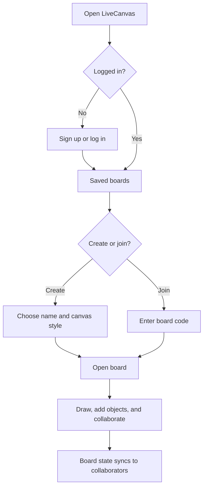
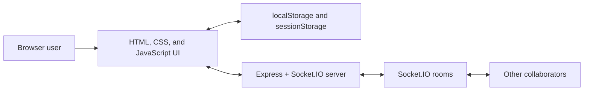

# LiveCanvas

LiveCanvas is a collaborative whiteboard built with HTML, CSS, JavaScript, Express, and Socket.IO. Create a board, share its code, and collaborate on drawings and canvas objects in real time.

## Features

- Create, join, search, and sort saved boards.
- Draw with pen, highlighter, and eraser tools; choose colours and brush widths.
- Add text, sticky notes, shapes, images, and tables to a board.
- Pan and zoom the infinite-style canvas, with undo and redo controls.
- Share boards with a short code and see collaborators’ cursors.
- Keep local board and account data in browser storage, with real-time board synchronization through Socket.IO.

## User flow



## Architecture



## Project structure

```text
Live-Canvas/
├── backend/server.js   # Express and Socket.IO collaboration server
├── index.html          # Whiteboard page
├── script.js           # Whiteboard tools, state, and socket events
├── style.css           # Whiteboard styling
├── saved.html          # Saved-board dashboard
├── login.html          # Login page
├── signup.html         # Registration page
├── room.html           # Room creation and joining page
└── assets/             # Logos, illustrations, profiles, and stickers
```

## Screenshots

> Add a saved-boards dashboard screenshot here: `docs/images/saved-boards.png`.

> Add a whiteboard screenshot here: `docs/images/whiteboard.png`.

> Add a mobile or live-collaboration screenshot here: `docs/images/collaboration.png`.

## Requirements

- [Node.js](https://nodejs.org/) 18 or later
- npm (included with Node.js)

## Run locally

1. Open a terminal in the project folder.
2. Install the server dependencies:

   ```bash
   cd backend
   npm install
   ```

3. Start the server:

   ```bash
   npm start
   ```

4. Open [http://localhost:3000](http://localhost:3000) in your browser.

The server keeps board state in memory, so restarting it clears active server-side board sessions. Browser-saved boards and local account data remain in that browser’s local storage.

## License

This project is licensed under the MIT License.
